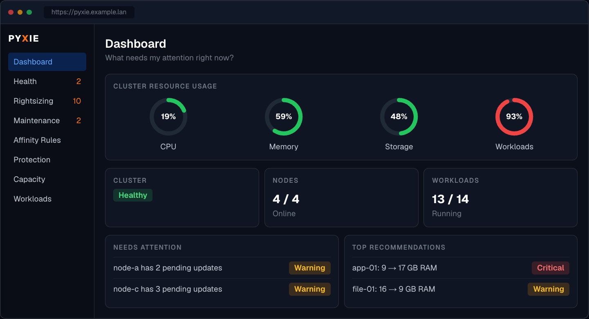
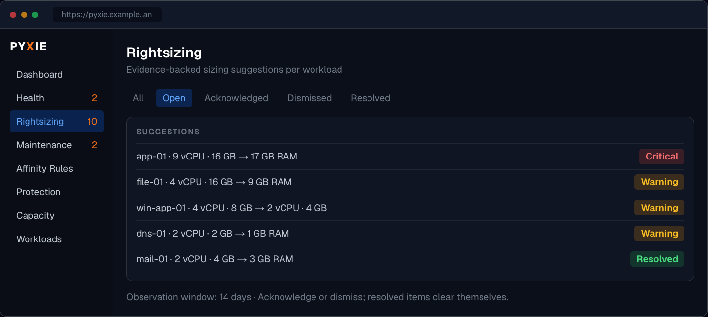
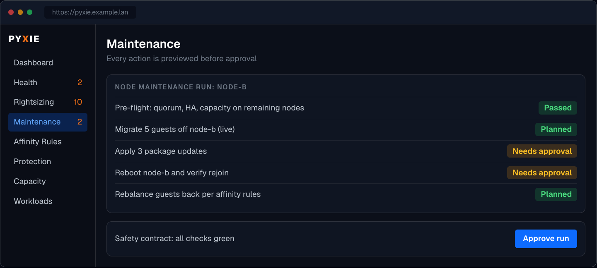
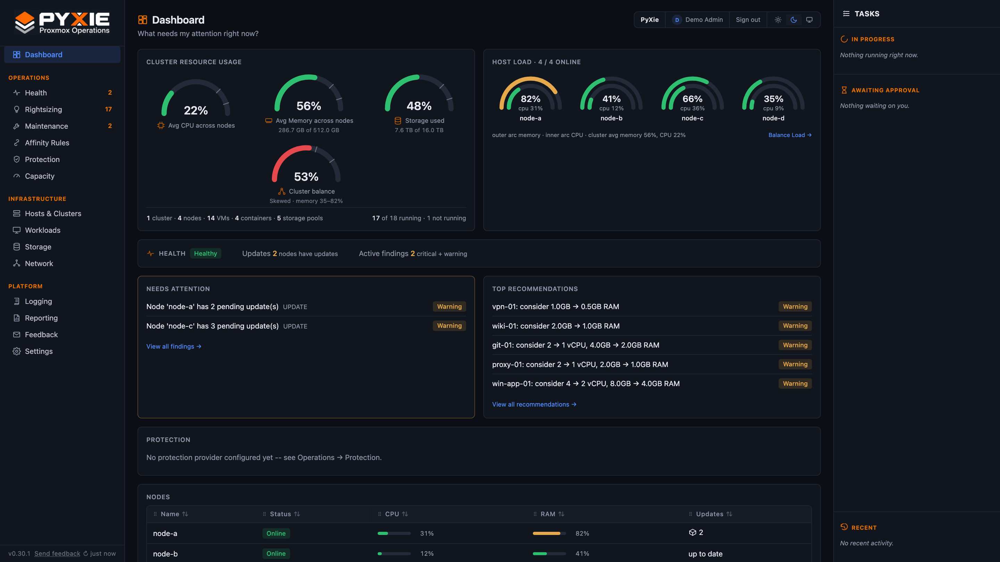
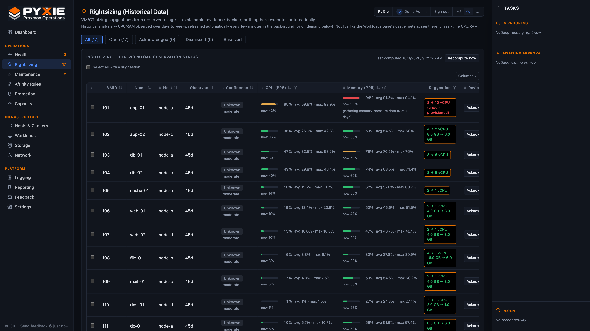
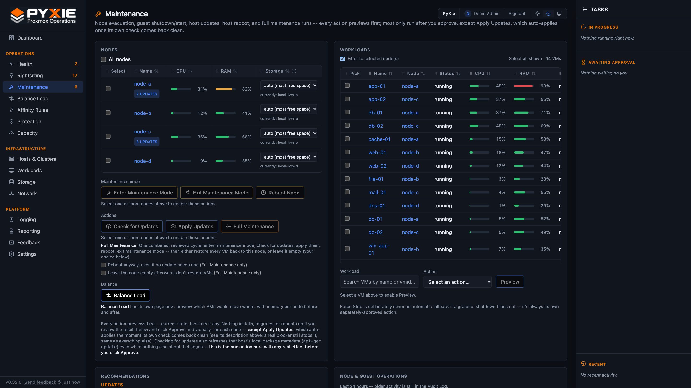

# PyXie Manager

Browser-based Proxmox VE (PVE) operations console: inventory, historical
metrics, findings/recommendations, capacity/rightsizing, backup/protection
visibility, and a real write-capable maintenance/migration/placement
engine, gated by an explicit Safety Contract on every mutating action.

**This is not a read-only product.** VM live migration was the first
write capability added; the app now includes a full staged
maintenance/migration/placement engine covering guest lifecycle, resize,
node reboot, host package updates, node/full maintenance runs, cluster
rebalancing, per-workload NIC VLAN reassignment, and PBS backup-job
membership -- see the Safety Contract section below for exactly how every
one of those is gated.

## Installation

PyXie runs as one Docker stack (web, API, worker, PostgreSQL, Redis and Caddy for HTTPS) on a single Ubuntu 24.04 VM.

1. **Install it:** follow [`docs/docker-caddy.md`](docs/docker-caddy.md). It covers what you need first (VM size,
   network, certificate choice) and a step-by-step first-time setup, from `git clone` to creating your admin account.
2. **Connect your Proxmox cluster:** on first sign-in PyXie shows a **New here?** banner on the Dashboard that opens
   **Platform > Quick start**, and **Platform > Integrations** walks the same setup in 8 steps with live status. Written
   up in [`docs/setup-guide.md`](docs/setup-guide.md); installing the host wrapper on each node is in
   [`docs/host-kit.md`](docs/host-kit.md) and [`docs/adding-a-host.md`](docs/adding-a-host.md).
3. **Keep it current:** [`docs/updates.md`](docs/updates.md) (Settings > Updates) and
   [`docs/patching-a-node.md`](docs/patching-a-node.md).

Bugs, requests and feedback: Platform > Feedback in the app, or [`docs/feedback.md`](docs/feedback.md).

The older native systemd install (no Docker) is still supported but is the legacy path:
[`docs/INSTALL.md`](docs/INSTALL.md). Pick one per host.

## Screenshots

Illustrative mockups; the data shown is fictional.

**Dashboard** -- cluster resource usage, environment health, and what needs attention right now:



**Rightsizing** -- evidence-backed sizing suggestions, triaged with acknowledge and dismiss:



**Maintenance** -- node evacuation, host updates and reboots, every action previewed and approved before it runs:



<details>
<summary>Screenshots of the running app (demo data)</summary>







</details>

## Versioning

The root `VERSION` file (plain text, e.g. `0.3.0`) is the single source of
truth -- not an environment variable, which would let a running deployment's
version silently drift from what's actually committed. `api/app/config.py`
reads it directly at startup (`Settings.APP_VERSION`, surfaced via
`GET /api/health` and the FastAPI app's own `version` field); `web/src/app/layout.tsx`
reads the same file server-side on every request and threads it down to the
sidebar footer -- both always reflect exactly what's on disk, no rebuild
required to pick up a bump. Follows semver (pre-1.0: breaking changes can
still happen between minor bumps). Every version bump gets a matching
annotated git tag (`vX.Y.Z`) pushed to GitHub, so `git tag`/the repo's Tags
page is the authoritative version history across every deployment running
this codebase -- multiple independent deployments can be on different
versions at different times, and the tag is how you know which is which.

## Configuration

Every environment-specific value (database connection, Redis connection,
PVE/PBS targets and credentials, the Fernet key used to encrypt stored
credentials, the global write kill switch, org/site identity) lives in a
single `.env` file, never committed. See `.env.example` for the full list
of variables and what each one does. A deployment's `.env` is the only
thing that differs between environments -- the application code is
identical everywhere it runs.

`PYXIE_CREDENTIAL_KEY` (the Fernet key encrypting stored PVE/PBS token
secrets) has no recovery path if lost -- every stored credential becomes
undecryptable. Back it up alongside any database dump, outside of git.

## Email notifications

Account invitations are sent as a multipart message: a plain-text body plus
an HTML version with the PyXie logo (attached inline, so it needs no
hosted image), a **Set up your account** button, the expiry, and a
copy-paste fallback link (`shared/pyxie_core/invite_email.py`,
`mail.send_email(..., html=..., inline_images=...)`). The link is a
one-time token that expires after 7 days. Sending is best-effort and
audited (`auth.invite.emailed`); if SMTP is off the invite is still created
and the link can be copied by hand.

**Where:** Platform -> Settings -> Notifications. The email server (SMTP)
settings live on the `AppSettings` singleton and are configured on that
page; the stored password is never returned in plaintext (`smtp_password_set`
is a boolean, same pattern as PVE credentials). `shared/pyxie_core/mail.py`
sends via stdlib `smtplib`, no external dependency. The invite-user flow
also uses it.

**Rules decide what gets emailed and to whom.** Each `notification_rules`
row picks a set of event categories (cluster quorum, node health/unknown,
pending updates, version drift, storage, capacity, failed tasks, backup
protection, placement -- empty means all), a minimum severity (critical
only, or warning and above), whether to also send recovery notices, and
recipients (explicit addresses and/or every active admin user). An event
matching several rules still emails each address once. Rules can be turned
off, edited, deleted, and test-sent without waiting for a real event; every
change is audited (`settings.notification_rule_*`). With email disabled or no
matching rule, nothing is emailed -- the in-app notification is still
recorded, and shown under Recent notifications on the same page.

**Flap hold-down.** A finding appearing or clearing is announced only once
that state has lasted `notification_hold_down_minutes` (default 5, 0 =
immediately). A host that keeps dropping in and out of quorum therefore
sends one alert when it settles instead of an alert and a recovery per
flip; flaps shorter than the hold-down are never announced. Each finding
records `state_since` and `notified_active` to drive this. It is applied per
state change, so a recovery is also held for the same period.

Email is sent after the findings transaction commits and never raises, so a
slow or broken mail server cannot affect findings.

## Safety Contract for every PVE write

`shared/pyxie_core/pve_write_client.py` is documented as, and actually is,
the ONLY module in this codebase allowed to issue a write request against
PVE -- `pve_client.py` stays GET-only by design. Every write goes through
two independent guardrails checked on every call, not just at startup:

1. **"Allow PyXie to write to Proxmox VE" must be turned on**, under
   Platform -> Settings. A global kill switch -- backed by
   `app_settings.pve_mutations_enabled`, not an env var (it used to be
   `PVE_MUTATIONS_ENABLED` in `.env`; moved to a live Settings toggle so
   it doesn't need a redeploy to change), and re-checked fresh on every
   single write call, not cached from operation-creation time.
2. **The credential used must come from the `maintenance` slot**, never
   `inventory` -- the two are loaded through separate code paths on
   purpose, so they can never accidentally cross.

Every write-capable operation type follows the identical staged sequence:
**dry-run (preview, no writes) -> awaiting_approval -> approved ->
revalidate against LIVE PVE state (never the DB cache) -> acquire a
resource lock -> execute -> monitor the real PVE task (a UPID is a
submission receipt, never treated as success on its own) -> independently
read state back -> verify -> audit.** Migration execution specifically
re-runs the exact same hard-block checks the preview showed (maintenance
mode, trust tier, PyXie affinity, PVE HA/CRS rules, CPU compatibility, PCI
passthrough, storage locality, headroom) via one shared function used by
both stages, so the two cannot drift apart.

**Self-protection:** the VM PyXie Manager itself runs on (configured via
`PYXIE_SELF_VMID`) is hard-blocked from `shutdown`/`force_stop`
unconditionally, no override exists -- this exists because a maintenance
plan spanning every guest on a host will otherwise happily include the
host running PyXie itself. Migrating or rebooting that VM is deliberately
still allowed: a node reboot's own PVE task already guarantees the guest
comes back up on its own, and migration is the actual safe way to move it
off a node that needs maintenance.

**Host-level network config is deliberately read-only.** The Network page
shows bridge/VLAN topology from PVE, and lets you reassign which VLAN a
workload's NIC is on (same Safety Contract as every other write above) --
but there is no write path for host bridge/VLAN-aware configuration
itself. That's a pending-changes/reload model where a bad apply can sever
a node's own network connectivity, a meaningfully different risk class
from every other write this app makes.

**Known, accepted risk (documented, not yet tightened):** the
`maintenance` PVE role is scoped at `/` (root), not per-resource. A bug in
PyXie could in principle touch any VM/storage/backup job visible to that
account, not only its intended target. Tightening this would mean real
ACL engineering that needs updating by hand every time PyXie's managed
resource set changes (new VM, new storage, new backup job) -- judged a
worse maintenance burden than the current root scope for a single-operator
deployment. Revisit for a deployment with more than one operator.

**Known, accepted risk (documented, not yet built):** capability grants
exist as descriptive metadata in the database but are not enforced as a
request-time authorization check anywhere in this codebase -- login is
the real gate. Consistent with how every other capability in this app
already works, not a special-cased gap; would need a deliberate decision
to change for all of them, not just one.

## Layered checks, HA/CRS is best-effort

PVE's own HA groups + HA rules are read and factored into migration/
maintenance eligibility (`shared/pyxie_core/maintenance.py::check_crs_affinity`),
but this is best-effort, not full parity with PVE's own HA manager:
node-affinity rules are fully parsed (including PVE 9's `node:priority`
syntax) and enforced as hard blocks; resource affinity/anti-affinity
(co-location between different workloads) is only flagged as present,
never fully resolved -- verify those manually for any HA-enrolled
workload before migrating it. The Workloads page's HA column tooltip
says the same thing.

## Stack

- **`web`** — Next.js 14 (App Router, TypeScript, Tailwind). Server
  components fetch the API directly; a handful of Next.js Route Handlers
  (`web/src/app/api/...`) proxy client-side mutations to the FastAPI
  backend.
- **`api`** — FastAPI + SQLAlchemy + Alembic, served by uvicorn.
- **`worker`** — Python, RQ-based. A background thread enqueues
  `worker.jobs.run_all` (discovery -> protection sync -> findings ->
  recommendations) on a schedule from Settings; the `operations` queue is
  where every dry-run's approved execution actually runs, one job per
  Operation, resumable across a worker restart via
  `resume_inflight_operations()` at startup.
- **PostgreSQL 16**, **Redis 7** (RQ queue backend).
- **Caddy** (Docker deployment only) terminates TLS on 80/443 and proxies to
  `web`; nothing else is published. The session cookie is marked `Secure`
  automatically when the request arrived over HTTPS.

### PVE API endpoint failover

Any member of a Proxmox cluster serves the whole cluster API, so PyXie does not
depend on one node. Discovery learns every member's management IP, and each
client gets an ordered list of endpoints: online members first (the configured
target hostname leading), then members last seen offline, then the node under
maintenance, then the configured hostname as a last resort. A member is
addressed by DNS name when that name (its node name plus the target hostname's
domain) currently resolves to its known IP, otherwise by IP.

Platform > Settings > Integrations shows the manually added entry point and the
auto-discovered members separately, in failover order, with each member's state
(Active / Standby / Unreachable / Excluded). An admin can choose a **preferred
member** to try first and untick **Use for failover** for any member PyXie should
never use as its API endpoint (migration 0034: `nodes.failover_enabled`,
`pve_targets.preferred_node_id`; audited as `pve_target.failover_updated`). The
manually added hostname stays the last resort.

On a connection failure (refused, DNS failure, connect timeout) the client moves
to the next member and repeats the request; auth errors, TLS errors, read
timeouts and HTTP errors do not fail over. A failed member is skipped for 60
seconds per process and is tried first again afterwards, so a recovered primary
is picked up automatically. Every discovery run records the endpoint it used on
the target (`pve_targets.endpoint_status`, shown on Platform > Settings >
Integrations), raises a **warning** finding while any member is unreachable, and
a **critical** finding when none is (notification category *Proxmox
connectivity*).

Shared code (models, PVE read/write clients, discovery, placement, every
workflow module) lives in `shared/pyxie_core/` and is imported by both
`api` and `worker` via a symlink at `api/pyxie_core` / `worker/pyxie_core`
pointing at `../shared/pyxie_core`.

## Testing

`api/tests/` (pytest, `pip install -r api/requirements-dev.txt` to get
pytest itself if it's not already in the venv). Every test is fully
isolated -- no real database or PVE connection, even for reads; see
`api/tests/conftest.py` and `api/tests/fakes.py` for why that matters --
this suite is built to make it structurally impossible for a "pure logic
check" test to accidentally issue a real PVE write, not just unlikely.

```bash
cd api && source .venv/bin/activate && python3 -m pytest tests/ -v
```

## Authentication

Local auth, no external identity provider. Bootstrap: the first visit to
`/login` detects zero `users` rows and shows an admin-account creation
form instead (`GET /api/auth/bootstrap-status`, `POST /api/auth/bootstrap`
-- refuses once any user exists). Passwords hashed with bcrypt (cost 12).
Sessions are opaque random tokens in a `sessions` table, 24h fixed TTL,
checked on every protected request via a FastAPI dependency
(`get_current_user`). Admin/Viewer roles: every mutating endpoint is
gated by `require_admin`; a Viewer's write UI is hidden client-side as
polish, but the real boundary is the backend 403. The browser's session
cookie is HttpOnly, forwarded by `web`'s server-side code as
`Authorization: Bearer <token>` -- the API is never reachable from the
browser directly. Login/logout/failed-login are all audited.

**Inviting users:** an admin creates an invite, which generates a
one-time accept link; if SMTP is configured (see above) the link is
emailed directly to the invitee rather than requiring the admin to
copy/paste it. **Offboarding:** deleting a user is only allowed once
that account has already been deactivated -- a deactivate-then-delete
sequence, not a one-step delete -- so removing access is always a
separate, reversible-until-confirmed step from permanently removing the
account.

## Historical metrics

`shared/pyxie_core/metrics.py` pulls PVE's own RRD data rather than
sampling continuously -- the *first* collection for an object backfills
`month`/`year` timeframes into `metric_points`, then every subsequent poll
tops up `hour`. Retention is a policy (`metrics.retention_days`, default
400) enforced by a periodic prune job.

`observation_stats()` computes avg/P95/max/sample_count/earliest/latest,
optionally windowed; `confidence_for_observation_days()` implements
cold-start bands (insufficient_data <7d, preliminary <30d, moderate <60d,
high 60d+).

## Findings, recommendations, capacity, rightsizing

- **Findings** (`shared/pyxie_core/findings.py`): an observed condition,
  reconciled every pass by a stable `dedupe_key` -- seen again bumps
  `last_observed`, not seen this pass auto-resolves it. Nothing is ever
  hard-deleted.
- **Recommendations** (`shared/pyxie_core/recommendations.py`):
  rightsizing, capacity-pressure, and pending-update suggestions, each
  with evidence/benefit/impact/confidence. Lifecycle is partly user-owned
  -- regenerating never reopens something a user dismissed.
- **Rightsizing** (`shared/pyxie_core/rightsizing.py`): conservative by
  design -- only ever suggests a reduction, never below 30 days of
  observed history for `moderate`/`high` confidence. Assessing all
  workloads is a genuinely expensive pass (per-workload percentile
  queries against `metric_points`), so results are computed by the
  scheduled background pass and cached into a singleton
  `rightsizing_cache` row (`GET /api/rightsizing` serves the cache,
  falling back to a live compute only if the cache has never been
  populated) rather than recomputed on every page load; `POST
  /api/rightsizing/recompute` (admin-only) forces an immediate refresh.
  Because of this, the Rightsizing page is explicitly labeled
  **(Historical Data)** in its own title, with a note explaining it
  reflects the last background pass, not the current instant -- unlike
  the Workloads page, which is live.

  How the numbers are chosen (v0.16 onward):
  - **Window:** running VMs are sized from the last 30 days
    (`RIGHTSIZING_WINDOW_DAYS`); stopped ones keep their full history.
    Confidence still counts the *whole* history, so a VM with a year of
    data is not downgraded because its sizing window is short.
  - **Peaks use the 99th percentile** (CPU and memory), not the absolute
    maximum, so one stray sample no longer forces an "increase". The
    absolute peak is the fallback when no P99 is available.
  - **Memory "increase" needs real pressure.** PVE's per-VM "used" memory
    includes the guest's file cache, so healthy cache-heavy VMs read
    95-98%. An increase is only suggested when the guest is also swapping
    in (at least 256 MiB/day over at least 7 of the last 14 days,
    from `workload_mem_pressure`); otherwise the row shows a note
    ("gathering memory-pressure data (N of 7 days)" or "high usage is
    file cache"). Containers keep the usage-only rule.
  - **Host-only VMs** (no balloon/guest memory stats) are not assessed
    for memory at all, because their memory figure is the host-side
    process size, not usage.
  - The table also shows a live "now" reading beside the historical peak.
- **Capacity** (`shared/pyxie_core/capacity.py`): allocated vs. observed
  per node/cluster, busiest node, most-constrained resource.

## Memory readings and ballooning

What the RAM columns show, and why it can differ from PVE:

- **Source of truth is PVE's cluster resources feed** (`cluster/resources`,
  the same figure as the VM's Summary screen and the Datacenter table),
  *not* the per-node VM list, whose `mem` is the host-side process size for
  ballooned VMs. A worker thread (`live_memory_loop`, every 30 s) writes it
  to `workload_live_mem`; readings older than 3 minutes are ignored and the
  history-based figure is the fallback. A flapping reading keeps the last
  good value.
- **Ballooning decides whether that figure means anything.** With the
  memory balloon device present, PVE asks the guest what it uses (what
  Windows Task Manager shows). With `balloon: 0` the device is removed and
  PVE falls back to the host process size, which is close to 100% for any
  VM that has touched its RAM. Such a VM is marked **host-only**
  (`workloads.mem_guest_stats = false`): its meter is shown muted with a
  tooltip, and it is excluded from memory rightsizing.
- **Ballooning column.** The Workloads table and the pInfo report show
  `Off`, `Pending` (configured, but a running VM still reports no guest
  stats) or `On` with the guest minimum. State logic lives in
  `shared/pyxie_core/balloon.py`. pHealth adds two checks: **Ballooning
  off** (warning) and **Ballooning not active yet** (info).
- **The balloon device cannot be hot-added.** A change made to a running VM
  is held by PVE as a *pending* change that applies at its next start or
  PVE-initiated reboot -- a restart from inside the guest does not apply
  it. Stopped VMs take the change immediately.
- **Enabling it.** `ops/set_vm_balloon.py` (dry run by default; run inside
  the API container) sets the minimum as a fraction of the VM's memory
  (`--fraction`, default 0.5) or as memory minus N MiB (`--below-max-mb`,
  for databases you do not want starved); the maximum is never changed.
  It goes through the PVE-writes switch and writes a
  `workload.balloon_configured` audit event. A PyXie action on the VM page
  is on the wish list.

## Protection subsystem

Generic contract (`protection_targets`/`protection_credentials`) +
normalized `protection_results` (tri-state `protected`: `true`/`false`/
`unknown`; `unknown` is never treated as safe). PBS is the fully
live-tested adapter today; Veeam/Commvault are structural-only, explicitly
marked `live_validation_status=not_tested` so structural support is never
mistaken for proven interoperability.

If a protection provider sync fails, every existing `ProtectionResult` row
for that provider is degraded to `confidence="stale"` (with the failure
recorded on the row itself) rather than silently keeping whatever
confidence its last successful sync produced -- a provider being
unreachable for an unknown length of time should be visibly untrustworthy,
not indistinguishable from a fresh, verified read.

## Maintenance, migration, and placement -- real write paths, staged

`shared/pyxie_core/maintenance.py` + the `*_workflow.py` modules implement
node evacuation, guest lifecycle, VM migration (live and offline
transport), resize, host package updates, node/full maintenance runs,
cluster rebalancing, per-workload NIC VLAN changes, and PBS backup-job
membership -- all through the Safety Contract described above. Quorum
math reads PVE's own live `/cluster/status` at call time (not a snapshot
of PyXie's own possibly-stale Node table), re-checked both at dry-run and
immediately before actually removing a node from service.

Resource locks (`shared/pyxie_core/locks.py`) prevent two PyXie operations
from fighting over the same node/workload/cluster; a partial unique index
(`uq_resource_locks_active_resource`) makes that structurally impossible
at the database level, not just application-level best-effort. Lock TTLs
are set to match each operation type's own real maximum runtime (its RQ
job timeout) plus a margin, not a flat default -- a migration/evacuation/
maintenance run needs to hold its lock for its actual multi-hour duration.

**Applying package updates is the one write that needs host-level setup.**
PVE's API can list updates but not apply them, so applying goes through a
wrapper installed on each node (a separate SSH trust model, one keypair per
PVE target, but installed and host-key-pinned per node). Everything else in
this section works from the PVE API tokens alone. See step 7 of
[`docs/adding-a-host.md`](docs/adding-a-host.md).

**Plans see their own earlier moves.** A batch plan (Balance Load, Bulk
Migrate, evacuation, full maintenance) is built one VM at a time against a
running tally of what the plan has already committed. The tally carries the
memory added to each destination *and* where each VM has been planned to
go (`placement.note_planned_move`, `PLANNED_KEY`), so PyXie affinity rules
and RAM headroom are evaluated against the plan, not just against today's
placement. Before v0.18.3 only memory was tracked, so a hard keep-apart
rule could not stop a plan sending both databases to the same empty node.
Each move is still re-checked, against live state, when it actually runs.

**Verify asks PVE, not the inventory.** The stage that confirms a node is
empty before it enters maintenance mode (and before a maintenance run
reboots it) counts running guests with a live PVE query
(`node_maintenance_workflow.running_on_node_live`), falling back to the
inventory only if PVE cannot be read. The inventory can lag a finished
migration by up to one cycle and used to fail a fully evacuated node.

**Locked VMs are caught in the preview.** PVE refuses to migrate a VM that
has a `lock` in its config (a running backup, or the stale remains of an
interrupted snapshot). The Enter Maintenance, Full Maintenance and
evacuation previews read each running VM's config and list any locked VM as
blocked (`maintenance.vm_lock_reason`), with the lock type and the fix, so
the plan cannot be approved only to fail partway through (m402, 2026-10-02:
a Commvault snapshot-delete lock stopped an evacuation after 18 moves).

Operational procedure: [`docs/patching-a-node.md`](docs/patching-a-node.md).

The Tasks panel (right side of every page) shows, for each operation,
when it started (or was requested) and who initiated and approved it.
Queued plan steps show the requester and the time they were queued, so a
stuck queue is visible.

The Workloads page has a paginated, searchable table (matching the same
search logic as the Maintenance page's VM picker) and a quick single-VM
**Migrate** action inline per row -- the same staged Safety Contract as
every other write, just reachable without going through the Maintenance
page first.

## Logging & audit trail

Platform -> Logging surfaces four distinct, clearly-labeled channels
rather than one merged log, each kept separate because they're
genuinely different-shaped records:

- **Audit Log** -- everything PyXie itself did or recorded: user actions
  (logins, settings changes, approvals) and its own background activity
  (discovery cycles, etc), via the structured `audit_events` envelope.
  Filterable by actor type (user vs. system) so user actions aren't
  buried under the much higher-volume background events.
- **PVE Tasks** -- PVE's own task history for the cluster (migrations,
  backups, snapshots, updates, ...), synced every discovery pass -- the
  same list visible in the Proxmox web UI under Tasks, plus a **"Failed
  only"** filter for troubleshooting and an expandable detail view with
  the workload's name (not just VMID) and its full task log fetched
  on-demand via `GET /api/tasks/{id}/log`.
- **PVE Cluster Log** -- PVE's own syslog-style cluster log (daemon
  restarts, corosync/quorum events, hardware issues), a new
  `cluster_log_entries` table synced from `/cluster/log` every discovery
  pass. Ambient system activity, distinct from PVE Tasks (job outcomes);
  PVE only keeps a small rolling buffer so this is expected to be sparse
  most of the time, not busy the way Tasks is.
- **Internal Jobs** -- whether PyXie's own background scheduler
  (discovery/metrics/recommendation runs) is actually executing on
  schedule.

**Linking a PVE task back to the PyXie user who caused it:** when a task
was the result of a PyXie-initiated operation, its detail view shows
"Initiated by (PyXie)" with the acting user and operation type. This is
*not* a foreign key -- `Operation.pve_upid` is deliberately cleared
between workflow stages (it's a transient in-flight pointer, not a
permanent record) -- so the link is reconstructed heuristically: a task
matches an operation if its start time falls within that operation's
active window (plus a small margin) and they share the same workload or
node. Task-to-workload resolution itself is keyed by `(cluster_id,
vmid)`, not `(node_id, vmid)`, because PVE enforces VMID uniqueness
cluster-wide (not per-node) and a task recorded on a VM's *source* node
during a migration would otherwise fail to resolve once `Workload.node_id`
moves to the destination.

## Database schema summary

- **Core hierarchy:** `organizations` -> `sites` -> `clusters` -> `nodes`
  -> `workloads`; `storage` with an explicit `scope`.
- **Provider framework:** `provider_categories`/`capabilities` as plain
  data rows; `providers` (instance registry) + `provider_capabilities` +
  `capability_grants` (scoped, currently metadata-only -- see above).
- **PVE targets/credentials:** `pve_targets` + `pve_credentials` (slots:
  `inventory`/`maintenance`/`administrative`, Fernet-encrypted secrets).
- **Operations engine:** `operation_types` (seeded, stage list per type) +
  `operations` (one row per in-flight or historical write action, full
  state machine) + `resource_locks` + `audit_events` (full envelope).
- **PVE logging:** `pve_tasks` (task history) + `cluster_log_entries`
  (PVE's syslog-style cluster log, deduped on `(cluster_id, pve_id)`).
- **Rightsizing cache:** `rightsizing_cache` -- a singleton row (same
  pattern as `app_settings`) holding the last background pass's full
  assessment set, so the Rightsizing page never recomputes on request.
- **Memory telemetry:** `workload_mem_pressure` (guest swap-in/out and
  fault counters, sampled about every 4 minutes, pruned after 90 days),
  `workload_live_mem` (latest live guest memory reading per VM, refreshed
  every 30 s); `workloads.mem_guest_stats`, `mem_used_bytes`,
  `mem_host_bytes`; `workload_configs.balloon_mb` (0 = no balloon device).
- **Placement:** `placement_affinity_rules` (PyXie-level keep-together/
  keep-apart, independent of PVE's own HA affinity), node performance/
  trust tiers (stored as `policies` rows), `workloads.preferred_node_id`
  (soft placement preference).
- **Metrics/Findings/Recommendations/Policies/Safety rules:** as before.
- **Protection:** `protection_targets`/`protection_credentials`/
  `protection_results`.
- **Maintenance planning:** `maintenance_plans` + `maintenance_plan_workloads`.
- **Host maintenance:** `host_maintenance_credentials` -- a completely
  separate SSH-based trust model from PVE API credentials, used only for
  package updates (PVE's own API has no endpoint to apply them, only list).
- **Auth:** `users`, `sessions`.
- **Internal jobs:** `internal_job_runs`.

Alembic migrations: `api/migrations/versions/`.

## Known limitations / open items

- PVE resource pools are not tracked at all -- a PBS backup job scoped to
  a pool is detected and explicitly refused (rather than guessing at its
  membership), not supported.
- Protection status matching is VMID-only, not namespaced by cluster/site
  -- fine for a single-cluster deployment, would need real scoping before
  a second cluster with potentially-colliding VMIDs is added.
- Host update verification confirms the specific approved packages
  actually disappear from the live upgradable list after applying (not
  just that the wrapper self-reported success), but does not yet
  cross-check reboot-required semantics against which packages were
  applied.
- Search/filter state is not yet persisted in the URL for every table.
- The Workloads table is wide and several inline selects lack visible
  labels beyond their column header -- usable once you know the page, a
  genuinely new operator would benefit from a further pass here.
- The PVE task -> PyXie operation link (Logging -> PVE Tasks) is a
  time-window + object-scope heuristic, not a foreign key -- correct
  against every real case tested so far, but two operations racing on
  the same workload within the same window could in principle
  misattribute a task. Not observed in practice; would need a real
  correlation ID threaded through to PVE to close entirely.
